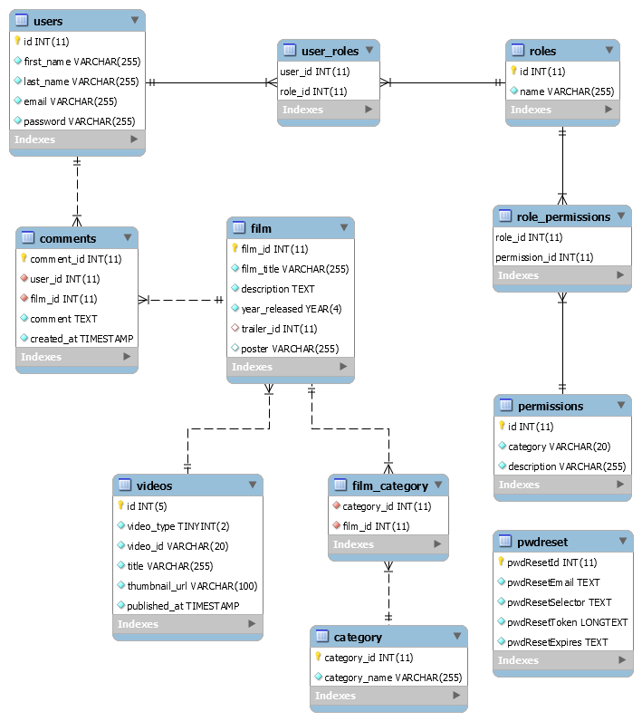

# **Getflix Project**
This group project is a **Streaming Site** inspired by [Amazon Prime Video](https://www.primevideo.com/) and [Netflix](https://www.netflix.com/be-en/). The goal is to **display a catalog of movies**.
The objective of this project is to let the group practice what they've learned about Backend *(PHP)* during the pass few days. This is a **10 days project** and it starts ***March 29*** until ***April 13, 2021***.

## **Website - coming soon**

## **Instruction link**
[https://github.com/becodeorg/BXL-Swartz-4-27/blob/master/2.The-Hill/2.PHP/GetflixProject.md](https://github.com/becodeorg/BXL-Swartz-4-27/blob/master/2.The-Hill/2.PHP/GetflixProject.md)

## **The Mission**
  ### Must-have features
  - [x] A session system: registration, connection / disconnection.
  - [x] Different rights: registrants have the right to comment on the content. You can add other rights depending on the different types of users.
  - [x] Include a search bar and sort by filters
  - [x] Make a secure code
  - [x] Deploy the site.

  ### Nice-to-have features
  - [x] Management of lost passwords.
  - [x] Integrate a newsletter with Mailchimp.

  ### Miscellanous information
  - [x] The videos will not be hosted by you, a simple link to the Youtube trailer will suffice.
  
## **Language Used**
- HTML5
- CSS3 and Bootstrap 5 / Grid CSS
- Javascript
- PHP

## **Prototype**
[https://www.figma.com/proto/jNtUTjTA6k9PBolBH78XYj/Getflix?node-id=23%3A4&scaling=scale-down&page-id=0%3A1](https://www.figma.com/proto/jNtUTjTA6k9PBolBH78XYj/Getflix?node-id=23%3A4&scaling=scale-down&page-id=0%3A1)

## **Database Diagram**

## **Contributors**
- [Adriana Lazurca](https://github.com/adriana-lazurca) 
- [François Leleu](https://github.com/FrancoisLeleu) 
- [Frances Navarro](https://github.com/frances-joffany-navarro)
- [Katinda Mangala](https://github.com/katinda)
- [Mehmet Ugurlu](https://github.com/mugurlu0)

## **Lighthouse Evaluation**

## **Credits**
#### Website Inspiration
- [Prime Video](https://www.primevideo.com/)
- [Netflix](https://www.netflix.com/be-en/)
  
#### Images

#### Tools
- [Figma](https://www.figma.com/) for the Prototype
- [MySQL Workbench](https://www.mysql.com/products/workbench/) for the Database Diagram
- [Trello](https://trello.com/) for group task management
- [InfinityFree](https://infinityfree.net/) used in deploying our project